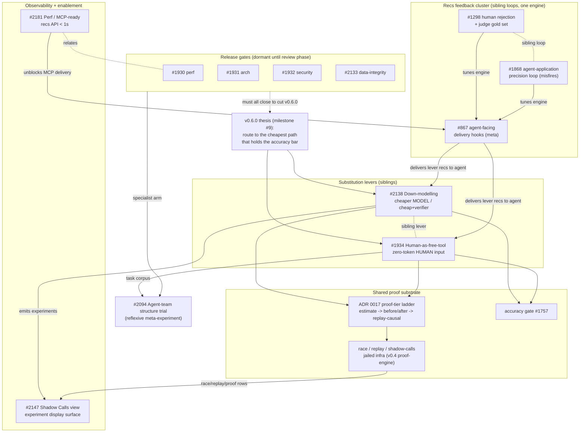

# v0.6.0 epic map — the semantic approach

A conceptual map of the open epics in milestone **v0.6.0** (the adversarial-agent /
"cheapest-path-that-holds-accuracy" release) and how they relate. This is an
orientation artifact, not a build order — the per-epic sub-issue dependency chains
live in the issues themselves (`blocked` + `**Blocked by** #N`).

## The organizing thesis

Everything in v0.6.0 hangs off one milestone-#9 claim: **route every task to the
cheapest path that still holds the accuracy bar** (the "adversarial agent" thesis).
Every product epic is one of four things:

- a **substitution lever** — a cheaper resource to route work to;
- the **proof machinery** that makes a substitution defensible (auditable, causal);
- the **feedback loop** that tunes/validates the recommendations the engine emits;
- the **observability / delivery** that gets those recommendations to a consumer.

The **release gates** sit orthogonal: dormant during the build phase, they must all
close before v0.6.0 can be cut.

## Semantic clusters

### 1. Substitution levers (the thesis made concrete)
Explicitly sibling epics — "same family, different cheap resource":

- **#2138 Down-modelling confidence loop** — the cheaper *model* (or a cheap-worker
  + verifier composite, the "Fugu lever"). Keystone **#2139** segments automation
  spend into task-classes; the rest is the proof ladder built on top. The moat vs.
  Sakana Fugu is that the down-model decision is *auditable* — Fugu hides the routing,
  we are the receipt.
- **#1934 Human-as-free-tool** — the *human* as the zero-token tool: where a one-line
  upfront answer would have avoided a large agent excursion (the inverse of
  steering-divergence). Bounded by an "optimal interruption rate" — over-asking
  destroys the autonomy value prop.

### 2. Shared proof substrate (what both levers stand on)
The ADR 0017 **proof-tier ladder** (estimate -> before/after -> replay-causal), the
**accuracy gate (#1757)**, and the reused **race / replay / shadow-calls** jailed
infra (v0.4 proof-engine). This substrate is the moat: *auditable, causal,
vendor-neutral* proof on the user's own history.

### 3. Recs feedback cluster (tunes the engine that emits the lever recs)
Three sibling loops, each a *distinct* channel into the same engine:

- **#1298** — a *human* rejects a rec (suppression list + judge gold set).
- **#1868** — the *agent* applies a rec live and its own telemetry exposes misfires
  (false-positive / wrong-scale / wrong-prescription taxonomy).
- **#867** — the *delivery* mechanism (SessionStart inject + PreToolUse steers); the
  pipe through which lever recs actually reach the agent. `meta` (edits `~/.claude`).

### 4. Observability & enablement
- **#2147 Shadow Calls view redesign** — the *display surface* for the experiments the
  levers generate (`model-eval-batch` ties explicitly to #2138; also proof / race /
  replay rows). Keystone A is an honest counting model (real vs synthetic vs skipped,
  live vs replay).
- **#2181 Perf / MCP-ready** — *enabler*: `/api/recommendations.json` is 4.7-11.7s,
  too slow to expose as an MCP server. Cut it to sub-second so delivery (#867 / #1333)
  and `/recs` are viable. Relates to gate #1930.

### 5. Reflexive meta-experiment
- **#2094 Agent-team structure trial** — studies *how to organize the agents building
  v0.6* (component-owners vs specialist swarm). Uniquely reflexive: its task **corpus
  is #1934's sub-issues** and its **specialist arm is the review gates #1930/31/32**,
  so it must run late, alongside the review phase.

### 6. Release gates (orthogonal, dormant until the review phase)
- **#1930** performance · **#1931** architecture · **#1932** security ·
  **#2133** data-integrity. Each banks concerns during the build phase and is
  decomposed only when feature work drains. All four must close to open the v0.6.0 cut.

## The graph

Edge semantics: solid arrows = produces / enables / depends; dashed `sibling` =
same-family peers with no dependency; dashed gate edge = release blocker.

## Two structural reads

1. **#2138 and #1934 are the only pure thesis levers** — every other product epic is
   supporting machinery (proof, feedback, observability, delivery).
2. **#2094 is the one cycle in the graph** — it consumes the other v0.6 work (#1934 as
   corpus, the gates as its specialist arm) as its own experimental material, so it is
   inherently late-phase.
